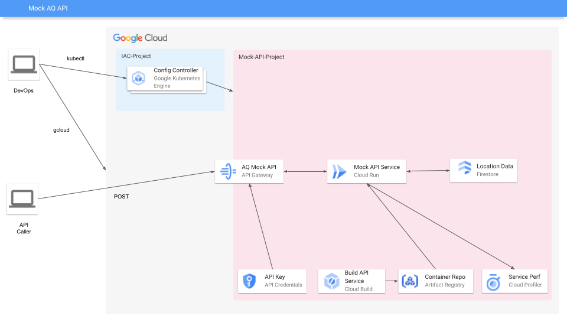

# GCP Mock APIs Environment Deployment

This project will create infrastructure that can be used to deploy any Mock API endpoints eaisly. Currently the first mock API is the Google Maps Platform new [Air Quality API](https://developers.google.com/maps/documentation/air-quality). The Air Quality API retrieves air quality indexes, pollutants, and health recommendations for specific locations. This is awesome however, what if you wanted to guarantee certain air quality indexes for a specific location?

This small project is an attempt so you can use the same API specs as (https://developers.google.com/maps/documentation/air-quality/reference) the live Air Quality API but guarantee the indexes returned. Perhaps for a demo or Proof-of-Concept, the request and return of this mock API will attempt to match the live Air Quality API JSON objects (RPC NOT SUPPORTED AT THIS TIME).

## Basics

In order to deploy the Google Cloud Infrastructure and build the API service you must have the basics of a Google Cloud environment created. This includes:

- Google Cloud Organization created
- Billing Account created
- Identity Access Management setup
    - A user with privileges to:
        - Create a project (at org or folder level) [Project Creator]
        - Attach the billing account [Billing Account User]
- A linux or OSX machine in which to install the following CLIs:
    - [Gcloud](https://cloud.google.com/sdk/docs/install)
    - [Kubectl](https://kubernetes.io/docs/tasks/tools/)
    - [KPT](https://kpt.dev/installation/)
    - [Arete](https://github.com/shaunmitchellve/arete) *optional

The Infrastructure-As-Code portion of this project used a Google Cloud Kubernetes tooling and the application runs on a Google Cloud managed service of KNative (Cloud Run), so having knowledge of Kubernetes, KRMs, containers and YAML will come in handy.



## Deployment

This deployment was written using the Kubernetes Configuration tool KPT and Kubernetes Config Connector tooling.

In order to deploy the mock api project you will need to make sure you have [Config Connector](https://cloud.google.com/config-connector/docs/concepts/installation-types) up and running. I would recommend setting up a [Config Controller](https://cloud.google.com/anthos-config-management/docs/concepts/config-controller-overview) backed by an Autopilot GKE cluster.

To make this easier you can use the [Arete CLI](https://github.com/shaunmitchellve/arete) to create a Config Controller cluster. It's also recommended to deploy the ***KCC-Namespaces*** solution.

## Mock Data

On the first time the app is run it will check to see if the Firebase collection exists. The collection name is set up in the `config/config.yaml` file or it can be passed in using the environment variable `AQ_COLLECTION-NAME`. If the collection does not exist then the app will read in the file `data/defaultData.csv` file. This file must be a CSV and must be in the following format:

`latitude,longitude,dateTime,regionCode,code,displayName,aqi,aqiDisplay,red,green,blue,alpha,dominantPollutant,category,categorie`

The app will create a new document for each record in the CSV file, this way the data is already loaded in prior to the first call to the mock API endpoint.

*NOTE:* This current version only supports english and french language codes. The default is english, if FR is passed in on the request then the service will return whatever is stored in the `categorie` column.

# Automated Deployment

*NOTE:* In each `infra` subfolder there should be a `setters.yaml` file that is a symbolic link to the `setters.yaml` in the `infra` folder. If for some reason there is an error from the `kpt fn render` processes then make sure this slink is set up properly.

## Setup Config Controller - Using Arete
Download the Arete CLI that matches your architecture from the GitHub Releases page.

Run: `arete create KCC-CLUSTER-NAME`

This will take a few minutes to create the GKE Cluster with Config Controller installed. Once this is complete, run `arete solution deploy kcc-namespaces`. The CLI will then prompt you to update some of the solutions variables.

| Variable | Description |
| -------- | ----------- |
| management-project-id | The GCP project id of were you created the config controller cluster |
| project-id            | This is the GCP project id that you want KCC to create the Mock API infra |
| admin-user            | This is the Google user or group that you wish to have admin access to submit the KRM's / resources to Config Controller |

## Deployment Script
There is a `deploy.sh` script in the root that will walk through setting up the Google Cloud assets.

*REMINDER:* Make sure that your kubectl context is pointing to the config controller instance

The deploy script takes 2 flags:

| Flag | Description |
| -- | -- |
| -p | Google Cloud Project ID that already exists w/ billing. All resources will be created in this single project |
| -r | The Google Cloud region you wish to create regional based assets in |

The deploy script will attempt to perform the following actions:

1. Download the Alpha CRDs for KCC - API Gateway and install them
2. Uses KPT to enable all the needed Google Cloud APIs and sets up a Docker Artifact Registry
3. Uses Cloud Build to build the AQ Mock API GO program
4. Uses KPT to setup and deploy a cloud run service pointing to the newly build docker image
5. Uses KPT to setup and deploy the API Gateway to point to the new Cloud Run service
6. Enables the API Gateway managed service, creates an API Key and restricts it to the newly enabled managed service

## Manaul Setup - NO KCC

Setup some environment vars
```bash
PROJECT_ID=<GCP-PROJECT-ID>
REGION=<GCP-$REGION>
ADMIN_USER=<USER-ACCOUNT-EMAIL>
```

1. Create a Google Cloud project

```bash
gcloud projects create $PROJECT_ID
````

2. If not already done, assign a billing account to the new project

```bash
gcloud billing projects link $PROJECT_ID --billing-account BILLING_ACCOUNT_ID
```

3.  Enable the require APIS in the project

```bash
gcloud services enable compute.googleapis.com cloudkms.googleapis.com servicemanagement.googleapis.com apigateway.googleapis.com firestore.googleapis.com run.googleapis.com artifactregistry.googleapis.com servicecontrol.googleapis.com loudbuild.googleapis.com apikeys.googleapis.com --project $PROJECT_ID
```

4. Create an artifact registry

```bash
gcloud artifacts repositories create REPO_NAME --location=$REGION --repository-format=docker --project=$PROJECT_ID
```

5. Build the GOLANG mock API service / container

```bash
gcloud builds submit . --project=$PROJECT_ID --config=cloudbuild.yaml --substitutions=_$PROJECT_ID=$PROJECT_ID,_$REGION=$REGION
```

6. Create Firestore collection

```bash
gcloud alpha firestore databases create --database=aq-mock-data --location=nam5 --type=firestore-native --project=$PROJECT_ID
```

7. Create Cloud run service

    - Create Service Account
        ```bash
        gcloud iam service-accounts create run-service-sa --display-name="Cloud Run ServiceAccount" --project=$PROJECT_ID
        ```

    - Add Roles to SA
        ```bash
        gcloud projects add-iam-policy-binding $PROJECT_ID --member="serviceAccount:run-service-sa@$PROJECT_ID.iam.gserviceaccount.com" --role="roles/datastore.user" --condition='resource.name=="projects/$PROJECT_ID/databases/aq-mock-data"'
        ```

    - Create Cloud Run Service
        ```bash
        gcloud run deploy aq-mock-service --ingress=INGRESS_TRAFFIC_ALL --timeout=15 --execution-environment=gen2 --image=$REGION-docker.pkg.dev/$PROJECT_ID/REPO_NAME/aq-mock-api:v0.0.4 --port=8080 --cpu-boost --max-instances=10 --min-instances=1 --service-account=run-service-sa@$PROJECT_ID.iam.gserviceaccount.com
        ```

8. Get the new Cloud Run service URL
    ```bash
    gcloud run services describe aq-mock-service --project=$PROJECT_ID --$REGION=$REGION --format="value(status.address.url)"
    ```

9. Create API Gateway Service Account
    ```bash
    gcloud iam service-accounts create api-gateway-sa --display-name="API Gateway Service Account" --project=$PROJECT_ID
    ```

    - Add Roles to SA
        ```bash
        gcloud iam projects add-iam-policy-binding $PROJECT_ID --member="api-gateway-sa@$PROJECT_ID.iam.gserviceaccount.com" --role="roles/run.invoker"
        ```

        ```bash
        gcloud iam service-account add-iam-policy-binding api-gateway-sa@$PROJECT_ID.iam.gserviceaccount.com --member='user:$ADMIN_USER' --role=roles/iam.serviceAccountUser
        ```


10. Modify the file `infra/2-gateway/api-spec.yaml` and after `address:` line add the URL you copied from above

11. Base64 encode the entire `infra/2-gateway/api-spec.yaml` file

12. Create the API Gateway
    - Create the API
        ```bash
        gcloud api-gateway apis create airqualityapi --project=$PROJECT_ID
        ```

    - Create the API Config
        ```bash
        gcloud api-gateway api-config create airquailtyapi-config --api=airqualityapi --openapi-spec="./infra/2-gateway/api-spec.yaml" --backend-auth-service-account="api-gateway-sa@$PROJECT_ID.iam.gserviceaccount.comæ --project=$PROJECT_ID
        ```

    - Create the API Gateway
        ```bash
        gcloud api-gateway gateways create airqualityapi-gateway --api=airqualityapi --api-config=airquailtyapi-config --location=$REGION --project=$PROJECT_ID
        ```


13. Enable the API Gateway service
    ```bash
    ms=$(gcloud api-gateway apis describe airqualityapi --project=$PROJECT_ID --format='value(managedService)')

    gcloud services enable $ms --project=$PROJECT_ID
    ```

14. Create an API Key and lock it down to the new API Gateway service

    ```bash
    gcloud beta services api-keys create --display-name="AQ API Key" \
    --api-target=service=$ms \
    --project=$PROECT_ID
    ```

15. Get the API Gateway URL and API KEY so you can make calls!
    ```bash
    echo "API GATEWAY URL"
    gcloud alpha api-gateway gateways describe airqualityapi-gateway --project=$PROJECT_ID --location=$REGION --format='value(defaultHostname)'

    echo "API KEY:"
    gcloud alpha api-gateway gateways describe airqualityapi-gateway --project=$PROJECT_ID --location=$REGION
    --format='value(defaultHostname)'
    ```